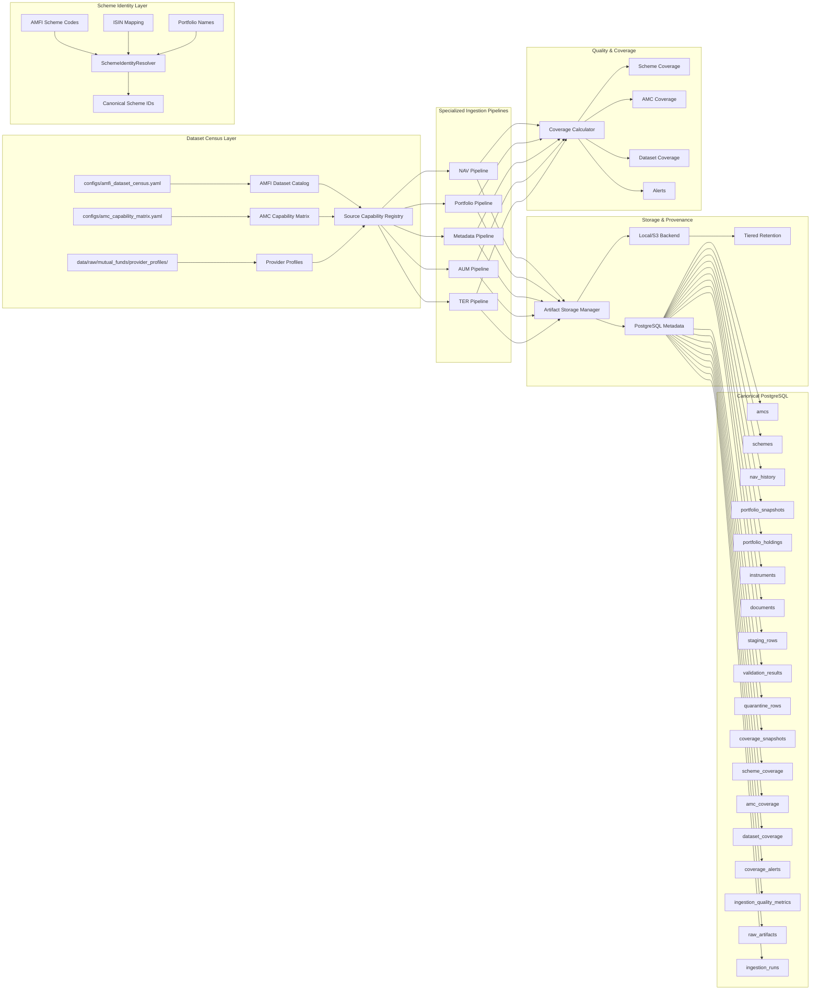

# System Overview — Mutual Fund Disclosure Ingestion (Updated Architecture)

_Updated: 2026-08-21. Describes the current implemented architecture with all pipeline components._

---

## Pipeline Flowchart



---

## Architecture Layers

| Layer | Components | Responsibility |
|-------|------------|----------------|
| **Layer 0 — Census** | `configs/amfi_dataset_census.yaml`, `configs/amc_capability_matrix.yaml`, `source_registry.py` | Machine-readable inventory of what data exists and where |
| **Layer 1 — Identity** | `scheme_identity.py` | Canonical scheme identification with AMFI code/ISIN mapping |
| **Layer 2 — Pipelines** | `nav_pipeline.py`, `portfolio_pipeline.py`, (future: metadata, AUM, TER) | Specialized ingestion per dataset family |
| **Layer 3 — Storage** | `artifact_storage.py` | Pluggable backends, retention policies, deduplication |
| **Layer 4 — Quality** | `coverage.py` | Coverage tracking, gap detection, alerts |
| **Layer 5 — Canonical DB** | `db.py` (18 tables) | PostgreSQL persistence with upserts |
| **Layer 6 — Orchestration** | `runner.py` (Task-URL Agent) | Legacy unified pipeline (being decomposed) |

---

## Key Architectural Decisions

### 1. Dataset Census First
Before ingesting, we catalog what's available:
- **AMFI Dataset Census** (20+ datasets discovered): NAV, Portfolio, Scheme Master, AUM, TER, Monthly/Quarterly data, Risk Parameters, NFO
- **AMC Capability Matrix** (53 AMCs profiled): Each AMC's strategy, formats, frequencies, working status
- **Source Capability Registry** (`source_registry.py`): Unified programmatic access to all census data

### 2. Separate Pipeline Families
Each major data type gets its own pipeline:
- **NAV Pipeline**: Daily time-series from AMFI (primary) + AMC sites (secondary)
- **Portfolio Pipeline**: Holdings from AMC provider sites (primary)
- **Metadata Pipeline**: Factsheets, SID, KIM, SAI (planned)
- **AUM Pipeline**: AUM/AAUM from AMFI (planned)
- **TER Pipeline**: Expense ratios from AMFI (planned)

### 3. Scheme Identity Layer
Free-text scheme names are NOT used as primary keys. Instead:
- AMFI scheme code (primary)
- ISIN div payout/reinvestment (secondary)
- Fuzzy name matching with plan/option disambiguation (fallback)
- Source mappings tracked for reconciliation

### 4. Raw Artifact Storage Abstraction
- **Backend-agnostic**: Local filesystem, S3, (GCS/Azure planned)
- **Tiered retention**: Hot (30d) → Warm (1yr) → Cold (7yr) → Archived
- **Hash deduplication**: SHA256 prevents re-downloads
- **Metadata in PostgreSQL, content in object storage**

### 5. Coverage as First-Class Citizen
- **SchemeCoverage**: Per-scheme expected vs stored observations
- **AMCoverage**: Aggregated per-AMC metrics
- **DatasetCoverage**: Global dataset health
- **CoverageAlerts**: Automated warnings for gaps/drops
- **IngestionQualityMetrics**: Per-run quality ratios

### 6. Provider-First Principle Maintained
- AMC websites are primary for portfolio disclosures
- AMFI is primary for NAV, Scheme Master, AUM, TER
- AMFI portfolio index is reference only (redirects to AMC sites)

---

## Pipeline Details

### NAV Pipeline (`nav_pipeline.py`)
```
AMFI NAV History Form (90-day windows)
    → Download text files (NAVAll.txt format)
    → Parse with nav_text_v1 (handles multiple formats)
    → SchemeIdentityResolver (scheme_code + ISIN)
    → Upsert to nav_history (unique: scheme_code + nav_date)
    → CoverageCalculator detects gaps (business days)
    → Incremental: daily latest; Backfill: 5-year windows
```

### Portfolio Pipeline (`portfolio_pipeline.py`)
```
AMC Capability Registry → Strategy per AMC
    → static_html (PPFAS, DSP, Groww): Direct HTTP + link extraction
    → playwright (Mirae, Invesco): Tab navigation
    → playwright_vlm (ICICI): React dropdowns + ZIP downloads
    → portfolio_excel_v1 / portfolio_zip_v1 parsers
    → SchemeIdentityResolver (scheme_name + AMC scope)
    → Upsert to portfolio_snapshots + portfolio_holdings
    → CoverageCalculator detects missing monthly periods
    → Incremental: 30-day lookback; Backfill: 2-year windows
```

### Strategy Patterns (Reusable)
| Pattern | AMCs | Extractor | Parser |
|---------|------|-----------|--------|
| static_disclosure_page | PPFAS, DSP, Groww | static_html | portfolio_excel_v1 |
| tabbed_portal | Mirae, Invesco | playwright | portfolio_excel_v1 |
| react_dropdown_filter | ICICI | playwright_vlm | portfolio_zip_v1 |
| accordion_dynamic | Aditya Birla | playwright_vlm | portfolio_excel_v1 |
| amfi_form_download | NAV, TER, AUM | static_html (POST) | nav_text_v1 |
| amfi_direct_links | Monthly/Quarterly | static_html | scheme_master_excel_v1 |

---

## Database Schema (18 Tables)

### Core Canonical Tables
1. `amcs` — AMC metadata (unique: normalized_name)
2. `schemes` — Scheme master (unique: scheme_code)
3. `nav_history` — Daily NAV (unique: scheme_code + nav_date)
4. `portfolio_snapshots` — One disclosure event (unique: scheme_id + reporting_date)
5. `portfolio_holdings` — Individual holdings (unique: snapshot_id + security_name + isin)
6. `instruments` — Securities by ISIN
7. `documents` — Abstract document records

### Provenance & Staging
8. `raw_artifacts` — Downloaded file metadata + checksums
9. `staging_rows` — Every parsed row before validation
10. `validation_results` — Audit log of all checks
11. `quarantine_rows` — Failed records with reasons
12. `ingestion_runs` — Top-level run tracking
13. `retry_queue` — Failed tasks for retry
14. `dataset_candidates` — Discovered file URLs

### Coverage & Quality (NEW)
15. `coverage_snapshots` — Daily coverage snapshots
16. `scheme_coverage` — Per-scheme coverage metrics
17. `amc_coverage` — Per-AMC aggregation
18. `dataset_coverage` — Global dataset health
19. `coverage_alerts` — Automated quality alerts
20. `ingestion_quality_metrics` — Per-run quality ratios

---

## CLI Entry Points

```bash
# Phase 1: Census & Profiling
python -m mutual_fund_ingestion bootstrap-sources
python -m mutual_fund_ingestion profile-providers --limit 3

# Dataset Census
python -m mutual_fund_ingestion census amfi          # Print AMFI dataset catalog
python -m mutual_fund_ingestion census amc           # Print AMC capability matrix
python -m mutual_fund_ingestion census registry      # Print combined registry

# NAV Pipeline
python -m mutual_fund_ingestion nav backfill --start 2020-01-01 --end 2026-08-21
python -m mutual_fund_ingestion nav incremental --days-back 2
python -m mutual_fund_ingestion nav gaps --scheme-code 120503
python -m mutual_fund_ingestion nav coverage --dataset nav_history

# Portfolio Pipeline
python -m mutual_fund_ingestion portfolio backfill --amcs PPFAS,DSP,GROWW
python -m mutual_fund_ingestion portfolio incremental --days-back 30
python -m mutual_fund_ingestion portfolio gaps --amc "PPFAS Mutual Fund"
python -m mutual_fund_ingestion portfolio coverage

# Coverage & Quality
python -m mutual_fund_ingestion coverage update
python -m mutual_fund_ingestion coverage report --dataset nav_history
python -m mutual_fund_ingestion coverage alerts --status open

# Storage
python -m mutual_fund_ingestion storage stats
python -m mutual_fund_ingestion storage retention-apply
python -m mutual_fund_ingestion storage cleanup-temp

# Legacy Task-URL Agent (still works)
python -m mutual_fund_ingestion run-agent --task-url URL --database-url $DATABASE_URL
python -m mutual_fund_ingestion inspect-run --run-id RUN_ID
python -m mutual_fund_ingestion retry-failed --run-id RUN_ID
```

---

## Data Flow Summary

```
┌─────────────────────────────────────────────────────────────────┐
│ 1. CENSUS (Static Configuration)                               │
│    configs/amfi_dataset_census.yaml  →  20+ datasets cataloged │
│    configs/amc_capability_matrix.yaml  →  53 AMCs profiled     │
│    data/raw/.../provider_profiles.json  →  Strategy per AMC    │
└──────────────────────────┬──────────────────────────────────────┘
                           ▼
┌─────────────────────────────────────────────────────────────────┐
│ 2. IDENTITY RESOLUTION                                         │
│    AMFI scheme_code + ISIN + fuzzy name → canonical scheme_id  │
│    Plan/Option (Direct/Regular, Growth/IDCW) normalized        │
│    Source mappings tracked for cross-source reconciliation     │
└──────────────────────────┬──────────────────────────────────────┘
                           ▼
┌─────────────────────────────────────────────────────────────────┐
│ 3. SPECIALIZED PIPELINES (Parallel, Independent)               │
│    NAV Pipeline          → nav_history (daily, AMFI primary)   │
│    Portfolio Pipeline    → portfolio_holdings (AMC primary)    │
│    Metadata Pipeline     → documents (factsheet, SID, KIM)     │
│    AUM Pipeline          → aum tables (AMFI primary)           │
│    TER Pipeline          → ter tables (AMFI primary)           │
└──────────────────────────┬──────────────────────────────────────┘
                           ▼
┌─────────────────────────────────────────────────────────────────┐
│ 4. STORAGE & PROVENANCE                                        │
│    ArtifactStorageManager (Local/S3) + PostgreSQL metadata     │
│    SHA256 deduplication → Tiered retention (hot/warm/cold)     │
│    Every record: source_url, checksum, fetch_time, parser_ver  │
└──────────────────────────┬──────────────────────────────────────┘
                           ▼
┌─────────────────────────────────────────────────────────────────┐
│ 5. QUALITY & COVERAGE                                          │
│    CoverageCalculator updates: scheme/AMC/dataset coverage     │
│    Gap detection: missing NAV dates, missing portfolio periods │
│    Alerts: low coverage, no data, stale data, coverage drops   │
└──────────────────────────┬──────────────────────────────────────┘
                           ▼
┌─────────────────────────────────────────────────────────────────┐
│ 6. CANONICAL POSTGRESQL                                        │
│    20 tables with upsert (ON CONFLICT DO UPDATE)               │
│    Unique constraints prevent duplication                      │
│    Foreign keys maintain referential integrity                 │
└─────────────────────────────────────────────────────────────────┘
```

---

## Current Implementation Status

| Component | Status | Notes |
|-----------|--------|-------|
| AMFI Dataset Census | ✅ Complete | 20 datasets cataloged in YAML |
| AMC Capability Matrix | ✅ Complete | 53 AMCs with strategies |
| Source Capability Registry | ✅ Complete | `source_registry.py` loads both |
| NAV Parser Fix | ✅ Complete | Handles AMFI 8-col + simplified formats |
| NAV Pipeline | ✅ Complete | Backfill + incremental + gap detection |
| Portfolio Pipeline | ✅ Complete | Strategy-aware, 6 AMCs working |
| Scheme Identity Layer | ✅ Complete | AMFI code/ISIN/name resolution |
| Coverage Models | ✅ Complete | 6 new tables + calculator |
| Artifact Storage | ✅ Complete | Local + S3 backends, tiered retention |
| Documentation | 🔄 In Progress | This file + architecture updates |

---

## Next Steps

1. **Implement remaining parsers**: scheme_master_excel_v1, ter_excel_v1, aum_excel_v1
2. **Build Metadata Pipeline**: Factsheet, SID, KIM, SAI parsing
3. **Add GCS/Azure backends** to artifact storage
4. **Create unified orchestrator** CLI for all pipelines
5. **Build review notebooks** for each pipeline
6. **Add Prometheus/Grafana metrics** export
7. **Implement scheme merge/rename handling** in identity layer